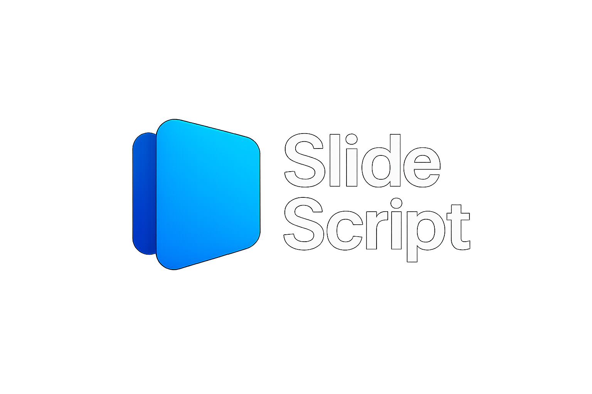

# SlideScript

SlideScript is a web-based presentation tool that allows you to create slides quickly and efficiently using a simple, markdown-like syntax. It's designed for speed and ease of use, letting you focus on your content.



## Features

-   **Markdown-Based Editing**: Write slides using familiar syntax.
-   **Live Preview**: See your slides update in real-time as you type.
-   **Presentation Mode**: Present your slides directly from the browser with a clean, full-screen interface.
-   **Code Block Support**: Includes syntax highlighting for various languages, perfect for technical presentations.
-   **PPTX Export**: Download your presentation as a `.pptx` file for offline use or sharing.
-   **Simple & Fast**: A minimal UI keeps things quick and distraction-free.

## Getting Started

To get a local copy up and running, follow these simple steps.

### Prerequisites

-   Node.js (v14 or later)
-   npm

### Installation

1.  Clone the repo:
    ```sh
    git clone https://github.com/Chamidu0423/Slide-Script.git
    ```
2.  Navigate to the project directory:
    ```sh
    cd Slide-Script
    ```
3.  Install NPM packages:
    ```sh
    npm install
    ```
    or
    ```sh
    npm install --force
    ```
5.  Run the development server:
    ```sh
    npm run dev
    ```
    The application will be available at `http://localhost:5173`.

## Usage

The syntax is designed to be intuitive:

-   **Slides**: Separate slides by wrapping content in curly braces `{}`.
-   **Titles**: Use `#` for a main title.
-   **Subtitles**: Use `##` for a subtitle.
-   **Bullet Points**: Start a line with `-`.
-   **Numbered Lists**: Start a line with `1.`, `2.`, etc.
-   **Quotes**: Start a line with `>`.
-   **Text Formatting**: Use `**bold**` for bold text and `*italic*` for italic text.
-   **Code Blocks**: Wrap your code in triple backticks \`\`\`. You can specify the language for syntax highlighting (e.g., \`\`\`javascript).

### Example Slide

```markdown
{
# Welcome to SlideScript
## The fastest way to create presentations

- Use {} to separate slides
- Use # for titles, ## for subtitles
- Use - for bullet points
}
```

## Exporting

To export your presentation, click the **Export PPTX** button in the header. This will generate and download a `.pptx` file of your slides.
